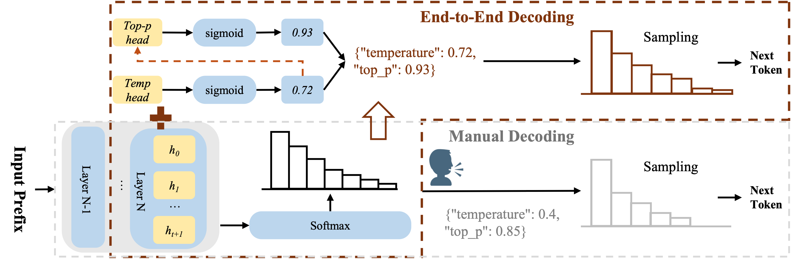

# AutoDeco
Official Implementation of "The End of Manual Decoding: Towards Truly End-to-End Language Models"

**AutoDeco** is a framework that adds token-level adaptive decoding parameter prediction capabilities to Large Language Models (LLMs). By adding lightweight prediction heads on top of pre-trained models, AutoDeco can dynamically predict optimal temperature and top-p parameters for each token during decoding.

## 🎯 Key Features

- **Token-Level Decoding Parameter Prediction**: Dynamically predict decoding parameters (temperature and top-p) for each generated token
- **Lightweight Design**: Only adds two small MLP prediction heads (~5MB), without modifying the base model
- **Universal Architecture**: Supports multiple mainstream LLM architectures (Llama, Qwen2/2.5, Qwen3, MoE models, etc.)
- **End-to-End Training**: Complete training with implicit gradient backpropagation through cross-entropy loss only 
- **Flexible Training**: Supports independent training of temperature head, top-p head, or joint training
- **Efficient Deployment**: Only saves AutoDeco prediction head weights during training, merges with base model during decoding.

## 🏗️ Architecture

The AutoDeco framework consists of two core components:



### Model Workflow

```
Input Tokens
    ↓
Base LLM (frozen during head training)
    ↓
Hidden States
    ├──→ LM Head → Logits
    ├──→ TempHead → Temperature
    └──→ TopPHead → Top-P
```

During training, the base LLM parameters are frozen, and only the two prediction heads are trained.

## 🤖 Supported Models

AutoDeco supports all current autoregressive LLMs, and we unified them with the following model architectures `AutoDecoModelForCausalLM` interface.

You can leave a message in  [#2](https://github.com/Zacks917/AutoDeco/issues/2)  to let us know your needs for AutoDeco, and provide the base LLMs you would like AutoDeco to integrate with. We will try our best to train and release them.

<div align="center">

| **Base Model** | **#Base Params** | **#AutoDeco Params** | **Download** |
| :------------: | :------------: | :------------: | :------------: |
| Llama-3.1-Nemotron-Nano-8B-v1 | 8B | 2.1M | [🤗 HuggingFace](https://huggingface.co/Jadeislaw/AutoDeco-Llama-Nemotron-8B)   |
| DeepSeek-R1-Distill-Qwen-7B   | 7B | 1.84M | [🤗 HuggingFace](https://huggingface.co/Jadeislaw/AutoDeco-R1-Distill-Qwen-7B)   |
| Qwen3-30B-A3B-Instruct-2507   | 30B | 1.05M | [🤗 HuggingFace](https://huggingface.co/Jadeislaw/AutoDeco-Qwen3-30B-A3B-Instruct-2507)   |
| OpenAI-GPT-OSS-20B   | 20B | 1.48M | [🤗 HuggingFace](https://huggingface.co/Jadeislaw/AutoDeco-GPT-Oss-20B)   |
| OpenAI-GPT-OSS-120B   | 120B | 1.48M | [🤗 HuggingFace](https://huggingface.co/Jadeislaw/AutoDeco-GPT-Oss-120B)  |
| Qwen3-235B-A22B-Thinking   | 235B | 2.1M | [🤗 HuggingFace](https://huggingface.co/zacks917/AutoDeco-Qwen3-235B-A22B-Thinking-2507)  |
| DeepSeek-V3.1-Terminus   | 671B | - | Comming Soon  |

</div>


## 🚀 Installation

### Recommended Requirements

- Python >= 3.10
- PyTorch >= 2.0
- CUDA >= 12.0 (recommended for training)

### Install Dependencies

```bash
# Clone repository
git clone --recurse-submodules https://github.com/Zacks917/AutoDeco.git
cd AutoDeco

# Install core dependencies
pip install -r requirements.txt

# Optional: for training monitoring
pip install wandb
```

## 💡 Quick Start

### Initialize AutoDeco Model

```python
python script/construct_autodeco.py \
    --base_model_name_or_path path_to_your_base_LLM \
    --output_dir path_to_your_AutoDeco_model
```

<!-- ### 2. Inference

```python
from transformers import AutoTokenizer

tokenizer = AutoTokenizer.from_pretrained("path/to/model")
inputs = tokenizer("What is the meaning of life?", return_tensors="pt")

# Forward pass to get predictions
outputs = model(**inputs)

# outputs contains:
# - outputs.logits: Regular language model logits
# - outputs.temp_logits: Predicted temperature values
# - outputs.top_p_logits: Predicted top-p values
```

### 3. Efficient Inference with vLLM

We have integrated AutoDeco with vLLM for efficient batch inference:

- Install vLLM from source code first
    ```bash
    cd vllm
    pip install -e .
    ```

- Inference
    ```bash
    # Use training script for evaluation
    python llm_eval.py \
        --model_name_or_path path/to/autodeco_model \
        --dataset aime24 \
        --temp 1.0 \
        --top_p 1.0 \
        --k 16 \
        --tp_size 4
    ``` -->

## 🔥 Training

### Prepare Training Data

Training data should be in JSONL format, with one sample per line. AutoDeco supports standard conversation format:


```bash
{
  "prompt": "formatted prompt text",
  "completion": "expected completion"
}

# example
{
  "prompt": "<|im_start|>user\nEvaluate the limit:$$\\lim_{(x, y) \\to (1, 2)} \\frac{(x-1)(y-2)-x+3}{x^2-2x+y^2-4}$$\nMake sure you output the final answer within \\boxed{}<|im_end|>\n< im_start>assistant\n",
  "completion": "......### ✅ Final Answer:\n$$\n\\boxed{-1}\n$$""
}
```

### Train AutoDeco Heads

Use the provided training script:

```bash
# Edit script/trl_train.sh to configure parameters
# Key parameters:
# - MODEL_NAME_OR_PATH: Your initialized AutoDeco Model Path
# - DATA_NAME: Training data filename (in data directory)
# - MAX_LENGTH: Maximum sequence length
# - train_temp: Whether to train temperature head
# - train_top_p: Whether to train top-p head

bash script/trl_train.sh
```

Training configuration examples:

```bash
# Train only temperature head
accelerate launch trl_train.py \
    --model_name_or_path AutoDeco-Llama-3.1-8B \
    --dataset_name train_data.jsonl \
    --train_temp true \
    --train_top_p false \
    --learning_rate 5e-6 \
    --num_train_epochs 1 \
    --output_dir ckpt/llama3_temp_head
```

## 📊 Inference

### We have provided users with vLLM installed based on the source code (which has been adapted for model_type as autodeco for model inference). This is used for quickly deploying the trained autodeco model, conducting efficient inference and saving parameters.

- Install vLLM from source code.
    ```bash
    uv venv /root/autodeco --python 3.12
    cd autodeco_vllm_v0.10.2
    uv pip install -e .
    ```

Before inference, the lightweight AutoDeco heads should first be merged with base LLM model.

```bash
python script/merge_autodeco.py merge \
    --autodeco-path path_to_your_autodeco_heads \
    --base-model-path path_to_your_LLM \
    --output merged_path
```


### Batch Evaluation with vLLM

```bash
# Single evaluation
python utils/llm_eval.py \
    --model_name_or_path ckpt/autodeco_model \
    --dataset aime24 \
    --temp 1.0 \
    --top_p 1.0 \
    --k 16 \
    --seed 42

# Batch evaluation with script (automatically generates multiple random seeds)
bash script/test_generation_tp4.sh aime24 1.0 1.0 -1 1.0 16 path/to/model # Tensor_parallel_size=4
bash script/test_generation_tp4.sh aime24 1.0 1.0 -1 1.0 16 path/to/model # Tensor_parallel_size=8
```

Evaluation results are saved in the `generation_log/` directory.


## 📁 Project Structure
```
AutoDeco/
├── model/                          # Model definitions
│   └──  templlm_auto.py            # Unified AutoDeco model 
│
├── trainer/                        # Trainers
│   └── trl_autodeco.py                # AutoDeco trainer
│
├── script/                         # Scripts
│   ├── trl_train.sh               # Training launch script
│   ├── test_generation.sh         # Batch evaluation 
│   ├── construct_autodeco.py      # construct autodeco model
│   └── merge_autodeco.py          # Merge or split heads
│
├── config/                         # Configuration files
│   └── deepspeed/                 # DeepSpeed configuration
│       └── deepspeed_zero3_gradaccu4.yaml
├── utils/                         # utils
│   ├── boxed_extract.py           # rule-based answer extractor
│   └── llm_eval.py                # batch evaluation
│
├── trl_train.py                   # Training main program
├── requirements.txt               # requirements
└── README.md                      # This document

```

## 🔧 Advanced Usage

### 1. Extract AutoDeco Heads from AutoDeco Model

```python
python script/merge_autodeco.py split \
    --full-checkpoint path_to_your_full_model \
    --output path_to_split_head
```

This generates a lightweight checkpoint (~5MB) containing:
- `config.json`: AutoDeco configuration (including base_model_name_or_path)
- `autodeco_heads.safetensors`: Heads weights

### 2. Merge AutoDeco Heads to Base Model (for vLLM Deployment)

If you need to create a complete model file with heads for inference engines like vLLM:

```python
python script/merge_autodeco.py merge \
    --autodeco-path path_to_autodeco_heads \
    --base-model-path path_to_base_LLM \
    --output path_to_your_full_model
```


## 🙏 Acknowledgements

This work can not be done without the help of the following works:

*   [**TRL**](https://github.com/huggingface/trl): A library to train transformer language models with reinforcement learning.
*   [**Megatron-LM**](https://github.com/NVIDIA/Megatron-LM): A powerful framework for training immense transformer models at scale.
*   [**vLLM**](https://github.com/vllm-project/vllm): A high-throughput and memory-efficient inference and serving engine for LLMs.
*   [**Transformers**](https://github.com/huggingface/transformers): A library providing thousands of pretrained models and an easy-to-use framework for training.

## 📝 Citation

If you use AutoDeco in your research, please cite:

```bibtex
@misc{wang2025endmanualdecodingtruly,
      title={The End of Manual Decoding: Towards Truly End-to-End Language Models}, 
      author={Zhichao Wang and Dongyang Ma and Xinting Huang and Deng Cai and Tian Lan and Jiahao Xu and Haitao Mi and Xiaoying Tang and Yan Wang},
      year={2025},
      eprint={2510.26697},
      archivePrefix={arXiv},
      primaryClass={cs.CL},
      url={https://arxiv.org/abs/2510.26697}, 
}
```

<!-- ## Acknowledgments

- Built on [Transformers](https://github.com/huggingface/transformers) and [TRL](https://github.com/huggingface/trl)
- Training framework uses [DeepSpeed](https://github.com/microsoft/DeepSpeed)
- Inference optimization uses [vLLM](https://github.com/vllm-project/vllm) -->

